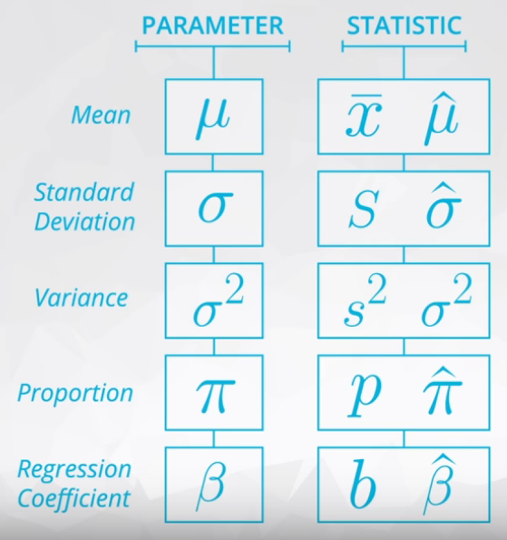
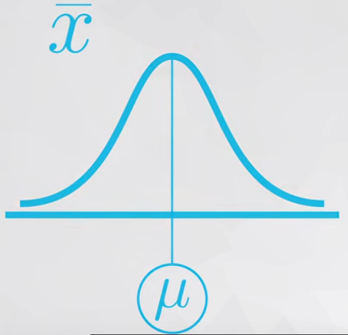
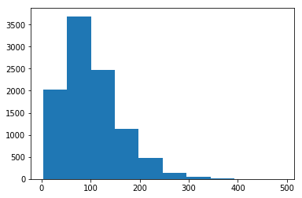
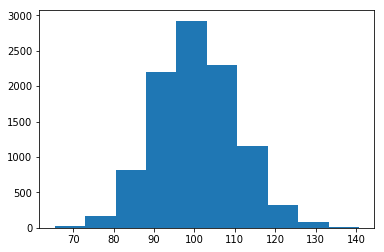

# Sampling Distribution

********************************************************************************

## Sampling distributions and Central Limit Theorem

Recap of Inferential Statistics.

#### Inferential Statistics

>In order to assure you are comfortable with the ideas surrounding inferential statistics. The next 4 concepts are aimed at the difference between Descriptive and Inferential Statistics. Actually applying inferential statistics techniques to data will be taught in later lessons.

#### Probability to Statistics

>This begins a set of lessons that will be more data oriented in the way that you are applying ideas, and less probability oriented.

>Often we use statistics to verify conclusions of probability through simulation. Therefore, simulation will be a large part of the way we show mathematical ideas moving forward.

#### Comparison Descriptive and Inferential Statistics

>In this section, we learned about how Inferential Statistics differs from Descriptive Statistics.

>* `Descriptive statistics` is about describing our collected data using the measures discussed throughout this lesson: measures of center, measures of spread, shape of our distribution, and outliers. We can also use plots of our data to gain a better understanding.

>* `Inferential Statistics` is about using our collected data to draw conclusions to a larger population. Performing inferential statistics well requires that we take a sample that accurately represents our population of interest.

>A common way to collect data is via a survey. However, surveys may be extremely biased depending on the types of questions that are asked, and the way the questions are asked. This is a topic you should think about when tackling the first project.

>We looked at specific examples that allowed us to identify the

>* Population - our entire group of interest.
>* Parameter - numeric summary about a population
>* Sample - subset of the population
>* Statistic numeric summary about a sample

### Sampling distribution

>A sampling distribution is the distribution of a statistic. Here we looked the distribution of the proportion for samples of 5 students. This is key to the ideas covered not only in this lesson, but in future lessons.

### Notation

<strong>Figure 1</strong>

>We commonly use Greek symbols as parameters and lowercase letters as the corresponding statistics. Sometimes in the literature, you might also see the same Greek symbols with a "hat" to represent that this is an estimate of the corresponding parameter.

### Other Sampling Distribution

It is possible to use other statistics.

* Standard Deviation
* Variance
* Difference in Means

The difference between parameters and statistics is the last one is varies and the first is fixed.

### Law of Large Number

This theorem preconizes the greater the number of the samples/trials the average of this sample will be close to the population mean. This is the reason we have simulated samples sizes of 10,000.

* Increasing the size of the sample the mean of this sample will be closer to the population mean.

[Read more in Wikipedia][wiki_lln] and [Investopedia][investopedia_lln]

[wiki_lln]: https://en.wikipedia.org/wiki/Law_of_large_numbers
[investopedia_lln]: https://www.investopedia.com/terms/l/lawoflargenumbers.asp

### Central Limit Theorem

Quite similar with the LLN theorem, but this is related to the shape of sample. It is necessary to plot a histogram to see the miracle.

* Increasing the size of the sample the shape of the sample will be closer to a normal distribution.

<strong>Figure 2</strong>

>The Central Limit Theorem states that with a large enough sample size the sampling distribution of the mean will be normally distributed.

>The Central Limit Theorem actually applies for these well known statistics:

>1. Sample means ($\bar x$)
>2. Sample proportions ($p$)
>3. Difference in sample means ($\bar x_1 - \bar x_2$)
>4. Difference in sample proportions ($p_1 - p_2$)

But is not applied to:

1. Variance or Standard Deviation
2. Correlation coefficient
3. Maximum value

>And it applies for additional statistics, **but it doesn't apply for all statistics!**. You will see more on this towards the end of this lesson.

Examples CLT in Figures 3 and 4.

<strong>Figure 3</strong>

<strong>Figure 4</strong>

Varying the value of the sample from 3 to 100, the bell shape could be identified.

### Bootstrapping

>Bootstrapping is a technique where we sample from a group with replacement.

>We can use bootstrapping to simulate the creation of sampling distribution, which you did many times in this lesson.

>By bootstrapping and then calculating repeated values of our statistics, we can gain an understanding of the sampling distribution of our statistics.
